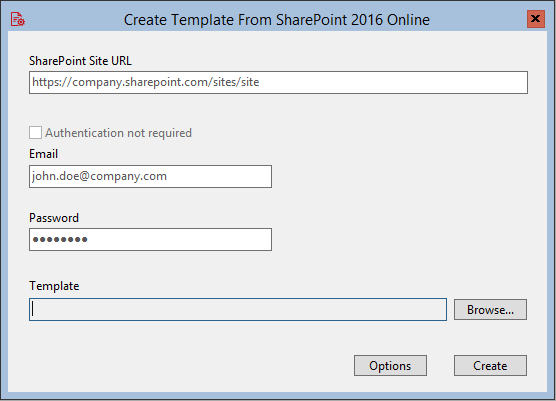

 
# SharePoint Provisioning Tool #

SharePoint 2013 On Premises, SharePoint 2016 On Premises and SharePoint 2016 Online Provisioning Tool front -end for the [Pnp-Sites-Core](https://github.com/OfficeDev/PnP-Sites-Core) Provisioning Framework.

## Introduction ##

The aim of this project is to make it easy for SharePoint admins to use the power of the provisioning framework in a user-friendly interface.

The tool allows you to perform 3 functions:
- Create templates from a SharePoint site
- Edit the saved templates
- Apply templates to a SharePoint site

## Operations ##
When executing the tool it opens up as a MDI application.


The three buttons are for "Create Template", "Edit Template" and "Apply Template" in that order. On clicking any of them 
will open the Select SharePoint Version screen.


If you select the wrong version you will get an error during the chosen operation.

-------------

#### Create Template

To create a provisioning template from a SharePoint site, click the "Create Template" button. After selecting the SharePoint version the following screen will appear.



Complete the fields as shown on the screen. The "Authentication not required" checkbox is for the On Premises versions and if the tool is run from the server and you are logged in with the farm account.

The "Options" button enables you to select what will be saved in the template. This includes the options to select what content will be saved with the template.


When the "Exculde base template" option is checked and the SharePoint site was created from one of the standard templates, then the saved template will not have any of the files, pages, content types or site fields matching in the base template.


After clicking the "Create" button a progress screen will appear showing the progress of the save operation.


----------
### Edit Template

To edit a saved template, click the "Edit Template" button. After selecting the SharePoint version the following screen will appear.


Click the "Browse..." button to select the provisioning template to edit.


Select the template that you want to edit from previous saved templates or download templates from the [SharePoint Templates Gallery](https://templates-gallery.sharepointpnp.com).


On the left the tree view of the template contents will be displayed. 
On the right one of four diffirent controls will be displayed.

The listbox control shows the child items of the selected node in the tree view. 
Double click will take you to that child item. Right click will enable you to delete unwanted items.


Most of the items will be displayed in a textbox control. 
This allows you to edit the details of that item as shown in the image below.


Note: If the contents of the textbox is cleared, when you save the template that item will be deleted from the template before saving.

Regional Settings, Web Settings and Composed Look items have their own form to edit. 
Below is the form for Regional Settings:


If the template item consists of Key Value pairs then they will be shown in the details view.
Double click on a row will enable you to edit the selected Key Value pair.


You also have the option to add a new Key Value pair.


While editing you can save the template.


-----------

### Apply Template


-----------
```
Disclaimer
THIS CODE IS PROVIDED *AS IS* WITHOUT WARRANTY OF ANY KIND, EITHER EXPRESS 
OR IMPLIED, INCLUDING ANY IMPLIED WARRANTIES OF FITNESS FOR A PARTICULAR 
PURPOSE, MERCHANTABILITY, OR NON-INFRINGEMENT.


